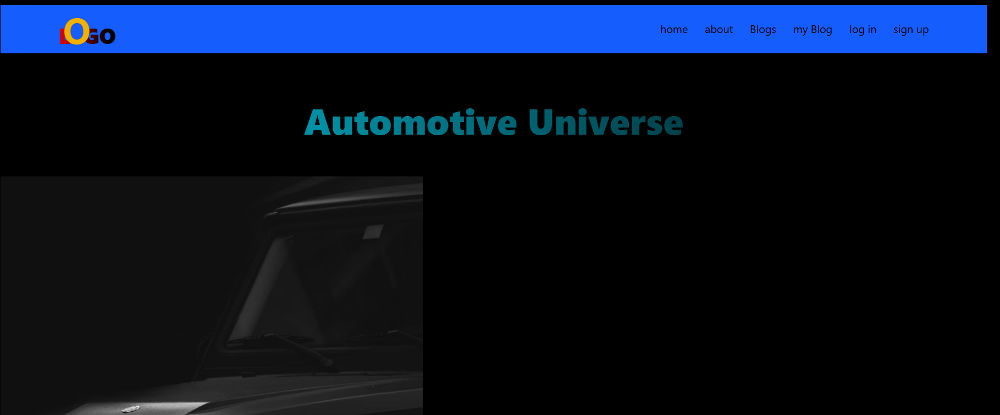
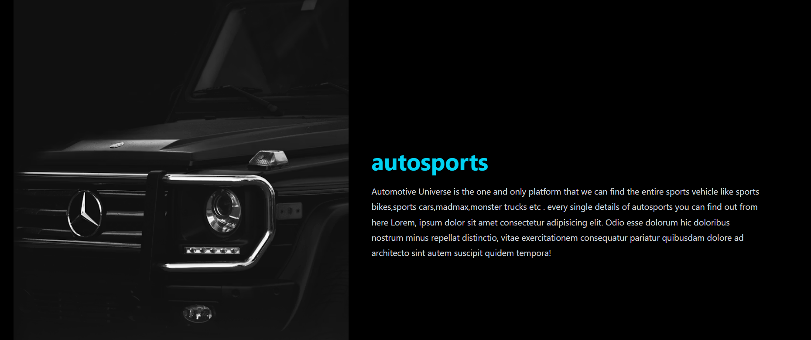

---

# 🚀 Responsive Navbar – Tailwind CSS Project

A modern and fully responsive navigation bar built using **Tailwind CSS** and **Font Awesome**. This project demonstrates responsive design principles and utility-first styling.

---

## 📌 Features

* ✅ Fully responsive navbar
* ✅ Gradient logo text
* ✅ Desktop navigation menu
* ✅ Mobile hamburger icon
* ✅ Hero section with gradient heading
* ✅ Flexible layout using Flexbox
* ✅ Styled using Tailwind CSS CDN

---

## 🛠️ Built With

* **HTML5**
* **Tailwind CSS (CDN version)**
* **Font Awesome Icons**
* Unsplash image for demo content


[link]( https://elbineldhose007.github.io/new-navbar/)

---

## 📂 Project Structure

```
Responsive-Navbar/
│
├── index.html
└── README.md
```

---

## 📱 Responsive Behavior

| Screen Size | Behavior                                      |
| ----------- | --------------------------------------------- |
| Large (lg)  | Full navigation menu visible                  |
| Medium      | Adjusted text & layout                        |
| Small       | Navigation links hidden, hamburger icon shown |

---

## 🎨 UI Highlights

* Gradient logo text using `bg-gradient-to-r`
* Responsive typography (`md:`, `lg:` breakpoints)
* Flexbox layout for alignment
* Utility-first styling approach

---

## 🚀 How to Use

1. Clone or download the project.
2. Open `index.html` in your browser.
3. Customize content, colors, or layout as needed.

---

## 🔧 CDN Links Used

### Tailwind CSS

```html
<script src="https://cdn.jsdelivr.net/npm/@tailwindcss/browser@4"></script>
```

### Font Awesome

```html
<link rel="stylesheet" href="https://cdnjs.cloudflare.com/ajax/libs/font-awesome/7.0.1/css/all.min.css" />
```

---

## 📸 Preview Section

The hero section includes:

* Gradient heading: **Automotive Universe**
* Responsive image
* Description text block

---

## 📈 Future Improvements

* Add functional mobile dropdown menu
* Add smooth animations
* Improve accessibility
* Convert to React / Next.js
* Deploy using Vercel or Netlify

---